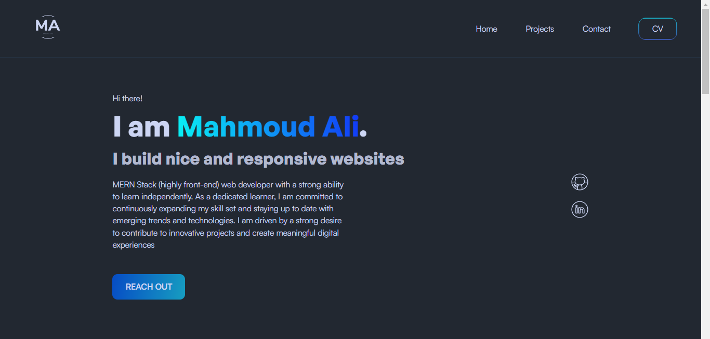

<h1 align="center">
  
</h1>

- 👨‍💻 As a CS student, I'm constantly learning and exploring new technologies to improve my skills.
- 💬 Ask me about my experience with JavaScript, ReactJS, and NodeJS, or anything related to web development.

### Connect with Me :

### 🛠 &nbsp;Tech Stack

&nbsp;
&nbsp;
&nbsp;
&nbsp;

&nbsp;
&nbsp;
&nbsp;
&nbsp;
&nbsp;
&nbsp;

[Portfolio Website](https://www.mahmoudali.me)
  

